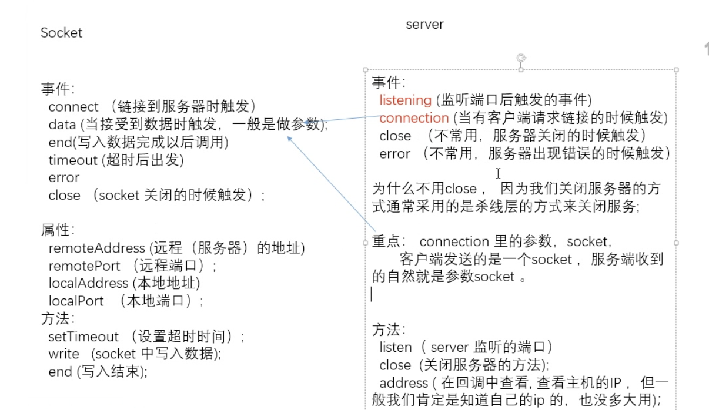

# 1. 版本
大版本号.次要版本号.小版本号
```
1.2.3 // 固定版本号
>=1.2.3 // 不低于1.2.3
^1.2.3 // 大版本号固定
~1.2.3 // 大版本号和次要版本号固定
```

# 2. 模块导出导入
1. 使用module.exports或者exports导出
```js
module.exports = {
  a: 1
}
exports.b = 3
// exports指向module.exports
```
2. 使用require导入
```js
const module = require('path')
```

# 3. Buffer
Buffer.alloc()
Buffer.from()
Buffer.byteLength()
StringDecoder.prototype.write

# 4. path
```js
const path = require('path')
/**
 * path.join()
 * path.resolve() // 从右往左
 * path.sep // 路径分隔符
 */
```

# 5. events
```js
const EventListener = require('events')
class Custom extends EventListener {}
const custom = new Custom()
custom.on('test1', test1)
custom.on('test2', test2)
custom.on('test3', test3)
custom.on('test3', test3)
custom.once('test', test)
custom.off('test1', test1)
custom.removeListener('test2', test2)
custom.removeAllListeners('test3')

function test (data) {
  console.log('test', data)
}

function test1 (data) {
  console.log('test1', data)
}

function test2 (data) {
  console.log('test2', data)
}

function test3 (data) {
  console.log('test3', data)
}
```

# 6. file
```js
const fs = require('fs')
/**
 * fs.readFile(filename, encoding, cb)
 * fs.readFileSync
 * fs.writeFile(pathname, encoding, cb)
 * fs.writeFileSync
 * fs.stat(filename, cb)
 * fs.unlink(filename, cb)
 * fs.isFile(file)
 * fs.isDirectory(directory)
 * fs.readdir(path, options, cb)
 * fs.mkdir(directory, cb)
 * fs.rmdir(directory, cb)
 * fs.rename(oldpath, newpath, cb)
 * fs.watch(path, options, cb)
 */
```

# 7. process
```js
/**
 * 1. process.argv [执行的node.exe路径，当前文件路径]
 */
```

# 8. net


注：查看node端口被占用情况，终端中输入：
```
ps aux | grep 'node'
```
